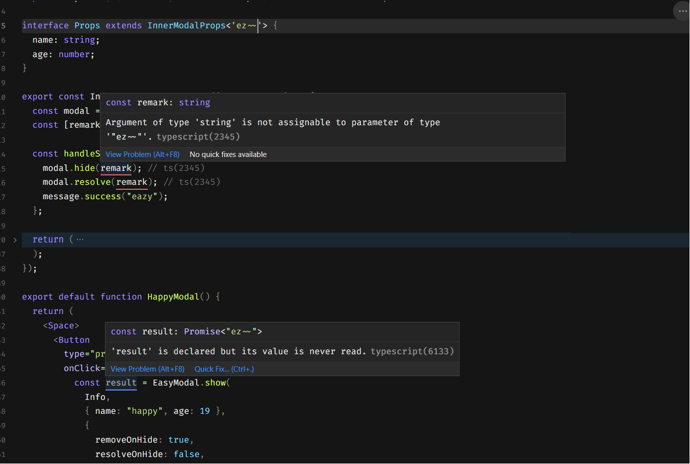

<h1 align='center'>Ez Modal React</h1></p>

This is a easy-to-use modal state management of React. It use React's context.

[](https://www.npmjs.com/package/ez-modal-react) [](https://www.npmjs.com/package/ez-modal-react) [](https://github.com/raotaohub/ez-modal-react/blob/main/LICENSE)

<p align='center'>English | <a href='./README.zh-CN.md'>简体中文</a> </p>

<a class="VPSocialLink" style="display:flex;justify-content:center;align-items:center;" href="https://discord.gg/vxsB2dtaZ5" aria-label="discord" target="_blank" rel="noopener" data-v-b8f6762d="" data-v-dbecf575=""><svg style="height:26px;width:26px;" role="img" viewBox="0 0 24 24" xmlns="http://www.w3.org/2000/svg"><title>Discord</title><path d="M20.317 4.3698a19.7913 19.7913 0 00-4.8851-1.5152.0741.0741 0 00-.0785.0371c-.211.3753-.4447.8648-.6083 1.2495-1.8447-.2762-3.68-.2762-5.4868 0-.1636-.3933-.4058-.8742-.6177-1.2495a.077.077 0 00-.0785-.037 19.7363 19.7363 0 00-4.8852 1.515.0699.0699 0 00-.0321.0277C.5334 9.0458-.319 13.5799.0992 18.0578a.0824.0824 0 00.0312.0561c2.0528 1.5076 4.0413 2.4228 5.9929 3.0294a.0777.0777 0 00.0842-.0276c.4616-.6304.8731-1.2952 1.226-1.9942a.076.076 0 00-.0416-.1057c-.6528-.2476-1.2743-.5495-1.8722-.8923a.077.077 0 01-.0076-.1277c.1258-.0943.2517-.1923.3718-.2914a.0743.0743 0 01.0776-.0105c3.9278 1.7933 8.18 1.7933 12.0614 0a.0739.0739 0 01.0785.0095c.1202.099.246.1981.3728.2924a.077.077 0 01-.0066.1276 12.2986 12.2986 0 01-1.873.8914.0766.0766 0 00-.0407.1067c.3604.698.7719 1.3628 1.225 1.9932a.076.076 0 00.0842.0286c1.961-.6067 3.9495-1.5219 6.0023-3.0294a.077.077 0 00.0313-.0552c.5004-5.177-.8382-9.6739-3.5485-13.6604a.061.061 0 00-.0312-.0286zM8.02 15.3312c-1.1825 0-2.1569-1.0857-2.1569-2.419 0-1.3332.9555-2.4189 2.157-2.4189 1.2108 0 2.1757 1.0952 2.1568 2.419 0 1.3332-.9555 2.4189-2.1569 2.4189zm7.9748 0c-1.1825 0-2.1569-1.0857-2.1569-2.419 0-1.3332.9554-2.4189 2.1569-2.4189 1.2108 0 2.1757 1.0952 2.1568 2.419 0 1.3332-.946 2.4189-2.1568 2.4189Z"></path></svg></a>

## ✨ Feature

1. Based on **Promise**, separate modal and ohter code.
2. Supports **hook** and **props** injection.
3. Supports **<a href="#typeinfer" title="">return value type inference</a>**,elevate the development experience.
4. Supports **>=React 16.8 version**.
5. Supports **<a href="#config" title="">config</a>** (When modal is hidden, Whether to remove and resolve by default)
6. Small size(~1kb after gzip)、easy access non-intrusive、support any UI library.

## 🔨 Let me see



## 📦 install

```shell
# with yarn
yarn add ez-modal-react -S

# or with npm
npm install ez-modal-react -S
```

## 🚀 Examples

1. **use EasyModal Provider**

```tsx
import EasyModal from 'ez-modal-react';

function App() {/* ... */}

ReactDOM.render(
    <EasyModal.Provider> // wrap your main Componet
      <App />
    </EasyModal.Provider>
  document.getElementById('root'),
);
```

2. **create modal**

```tsx
import easyModal from 'ez-modal-react';

const InfoModal = EazyModal.create((props) => (
  <Modal open={props.visible} onOk={props.hide} onCancel={props.hide}></Modal>
));
```

3. **anywhere use it**

```tsx
import easyModal from 'ez-modal-react';
import InfoModal from './InfoModal';

EasyModal.show(InfoModal, { name: 'foo' }).then((resolve) => {
  console.log(resolve);
});
```

- That's the core functionality，Here's the better experience

---

## ☀️ More

1. **Inferred the return value type**

Your Component Props should **extends InnerModalProps**,to enable it to derive the correct return value type

```diff
import EasyModal, { InnerModalProps } from 'ez-modal-react';

+ interface IProps extends InnerModalProps<'modal'/* here*/> {
+   age: number;
+   name: string;
+ }

export const InfoModal = EasyModal.create(
+ (props: Props) => {
  return (
    <Modal
      title="Hello"
      open={props.visible}
      onOk={() => {
+       props.hide(); //(property) hide: (result: 'modal') => void ts(2554)
      }}
      onCancel={() => {
+      props.hide(null); // accepts null as a parameter,this makes it not have to worry about type errors, which is great to use
      }}
    >
      <h1>{props.age}</h1>
    </Modal>
  );
});

+ // "The property 'age' is missing in the type '{ name: string; }'... ts(2345)"
EasyModal.show(InfoModal, { name: 'foo' }).then((resolve) => {
  console.log(resolve); // if everything is in order. we will get 'modal'
});
```

2. <a name="use hook" id="usehook">**If you like to use hook**</a>

```diff
+ interface IProps extends InnerModalProps<'modal'> {
+   age: number;
+   name: string;
+ }

export const InfoModal = EasyModal.create((props: Props) => {
+  const modal = useModal<Props /* here */>();
   console.log(modal.props) // current component's props
+  modal.hide(); // (property) hide: (result: 'modal') => void ts(2554)

  return <Moda>/*...*/</Moda>;
});
```

3. <a name="config" id="config">**config default**</a>

> 1. When the modal is hidden, it is remove by default.
> 2. When the modal is hidden, it is resolve by default.
> 3. Meet the vast majority of scenarios. EasyModal also provides a reject method.

- How to change the default behavior: pass in the third parameter in the open method.

```diff
EasyModal.open(Component, {},
+  config:{
+    resolveOnHide:false,
+    removeOnHide:false,
+  }
);
```

## 📚 API

```tsx
const CreatedModal = EasyModal.create(Component); // create EasyModal Modal； return EasyModalHOC

const result = EasyModal.open(CreatedModal, Props); // open CreatedModal Modal； return promise

const ______ = EasyModal.hide(CreatedModal); // hide CreatedModal Modal； return undefined

props; // Within a component, EasyModal injects additional properties in addition to the user's own parameters

const modal = useModal(); // in CreatedModal useModal；return same as props

type props | modal :
 {
  id: string; // current Modal id
  visible: boolean; // current Modal open state
  hide: function; // hidden current Modal fn
  remove: function; // remove current Modal fn
  resolve: function; // resolve current Modal fn
  reject: function; // reject current Modal fn
  ...
}
```

- About the difference between useModal and injected props

> 1. The **props** and **useModal()** return values obtained inside the component have the same properties and methods>
> 2. The 'hide' 'resolve' method of the **useModal()** return value does not have type inference by default like most hooks. You must explicitly pass the props type of the current component to the useModal method.
>    > btw, That's exactly why I did this project, I like to use props directly, but nice-modal-react can't provide it

<a href="#usehook" title="use hook">use hook</a>

## 🎮 Codesandbox Demo

[Demo Link](https://codesandbox.io/p/sandbox/confident-shape-rt7bzr?embed=1)

## ⭐ source of inspiration

1. fhd Inc @xpf
2. [nice-modal-react](https://github.com/eBay/nice-modal-react)

## Acknowledgement

Thanks to [SevenOutman (Doma)](https://github.com/SevenOutman) repository building support, I consulted his [aplayer-react](https://github.com/SevenOutman/aplayer-react) project

## ⌨️ Ohter

[Issues](https://github.com/raotaohub/ez-modal-react/issues)

## LICENSE

[MIT](https://github.com/raotaohub/ez-modal-react/blob/main/LICENSE)

---
