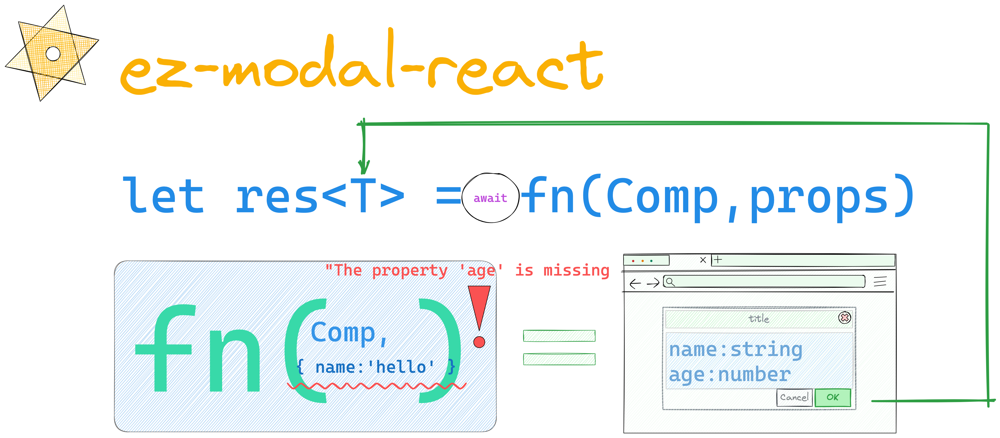

<p><h4 align='center'>ez modal react</h4></p>

<span style="margin-left:32px">The</span> concept of EasyModal is simple: to treat the operations of modals as asynchronous events, managing their lifecycle through Promises. It also provides type inference and constraints.

<p align='center'>English | <a href='./README.zh-CN.md'>简体中文</a> </p>

<p align="center">
<a href="https://www.npmjs.com/package/ez-modal-react" target="__blank"></a>
<a href="https://www.npmjs.com/package/ez-modal-react" target="__blank"></a>
<a href="https://raotaohub.github.io/ez-modal-react-book/en-US" target="__blank"></a>
<a href="https://raotaohub.github.io/ez-modal-react-book/en-US" target="__blank"></a>
</p>

## ✨ Feature

1. Promise-based modal lifecycle without repetitive visibility state.
2. Type-safe modal props and Promise result inference.
3. Next.js Pages Router and App Router support with a published `"use client"` boundary.
4. Provider-scoped stores and isolated manager instances through `createEasyModal()`.
5. Small, non-intrusive, and UI-library agnostic.

## 🔨 Documentations

[中文文档](https://raotaohub.github.io/ez-modal-react-book) | [English](https://raotaohub.github.io/ez-modal-react-book/en-US)

[Example](https://raotaohub.github.io/ez-modal-react-book/example) | [codesandbox](https://codesandbox.io/p/sandbox/confident-shape-rt7bzr?embed=1)

## 📦 install

```shell
# 2.0 alpha
npm install ez-modal-react@2.0.0-alpha.0

# or
yarn add ez-modal-react@2.0.0-alpha.0
```

## 🚀 Examples

1. **use EasyModal Provider**

```tsx
import EasyModal from 'ez-modal-react';

ReactDOM.render(
    <EasyModal.Provider> // wrap your main Componet
      <App />
    </EasyModal.Provider>
  document.getElementById('root'),
);
```

2. **create modal**

```tsx
import EasyModal, { InnerModalProps } from 'ez-modal-react';

interface IProps extends InnerModalProps<'modal'> {
  age: number;
  name: string;
}

const InfoModal = EazyModal.create((props: IProps) => (
  <Modal
    open={props.visible}
    //(property) hide: (result: 'modal') => void ts(2554)
    onOk={() => props.hide('modal')}
    onCancel={() => props.hide(null)}
    afterClose={props.remove}
  >
    <h1>{props.age}</h1>
    <h1>{props.name}</h1>
  </Modal>
));
```

3. **anywhere use it**

```tsx
// "The property 'age' is missing in the type '{ name: string; }'... ts(2345)"
const res = await EasyModal.show(InfoModal, { age: 10 });
console.log(res); // modal
```

## Next.js

The package entry is a Client Component boundary, so it works with both the Pages Router and App Router. Modal methods are client-only: call `show`, `update`, `hide`, and `remove` from event handlers or effects, not Server Components or Server Actions.

### App Router

```tsx
// app/providers.tsx
'use client';

import type { PropsWithChildren } from 'react';
import EasyModal from 'ez-modal-react';

export function Providers({ children }: PropsWithChildren) {
  return <EasyModal.Provider>{children}</EasyModal.Provider>;
}
```

```tsx
// app/layout.tsx (Server Component)
import { Providers } from './providers';

export default function RootLayout({ children }: { children: React.ReactNode }) {
  return (
    <html lang="en">
      <body><Providers>{children}</Providers></body>
    </html>
  );
}
```

### Pages Router

Wrap `Component` with `EasyModal.Provider` in `pages/_app.tsx`.

## Isolated Managers

The default export remains backward compatible. For multiple roots, micro-frontends, tests, or nested applications, create one manager per Provider:

```tsx
import { createEasyModal } from 'ez-modal-react';

export const adminModal = createEasyModal();

<adminModal.Provider>
  <AdminApp />
</adminModal.Provider>;

adminModal.show(AdminDialog, props);
```

A modal created by one manager must be shown through that same manager. Mount one Provider per manager for deterministic imperative API routing.

## 2.0 Alpha Migration Notes

- Existing default calls such as `EasyModal.show()` remain supported.
- Calling an imperative method before its Provider mounts, after it is disposed, or during server rendering now throws a descriptive error instead of targeting stale global state.
- Pending modal promises reject with `EasyModalProviderUnmountedError` when their Provider is disposed.
- Use `createEasyModal()` when an application needs more than one Provider.

## 🔄 Update Modal Props

You can update modal props dynamically using the `update` function:

### Merge Mode (Default)

By default, `update` merges new props with existing props:

```tsx
// Show modal with initial props
EasyModal.show(InfoModal, { name: 'Alice', age: 25, fileList: ['file1'] });

// Update only name, keeps age and fileList
EasyModal.update(InfoModal, { name: 'Bob' });
// Result: { name: 'Bob', age: 25, fileList: ['file1'] }
```

### Replace Mode (v1.0.6+)

Use `{ merge: false }` to completely replace props:

```tsx
// Show modal with initial props
EasyModal.show(InfoModal, { name: 'Alice', age: 25, fileList: ['file1'] });

// Replace all props with new ones
EasyModal.update(InfoModal, { name: 'Bob' }, { merge: false });
// Result: { name: 'Bob' } - age and fileList are removed
```

This is useful when you want precise control over which props to update without carrying over previous values.

### Use Cases

**Form Data Updates:**
```tsx
// Keep form structure, update loading state
EasyModal.update(FormModal, { isLoading: true });

// Reset form completely
EasyModal.update(FormModal, { formData: newFormData }, { merge: false });
```

**File List Management:**
```tsx
// Add files while keeping other props
EasyModal.update(UploadModal, { files: [...oldFiles, newFile] });

// Replace file list configuration
EasyModal.update(UploadModal, { files: newFiles, maxFiles: 1 }, { merge: false });
```

## Acknowledgement

1. fhd Inc @xpf
2. [nice-modal-react](https://github.com/eBay/nice-modal-react)
3. Thanks to [SevenOutman (Doma)](https://github.com/SevenOutman) repository building support, I consulted his [aplayer-react](https://github.com/SevenOutman/aplayer-react) project

## LICENSE

[MIT](https://github.com/raotaohub/ez-modal-react/blob/main/LICENSE)

---
