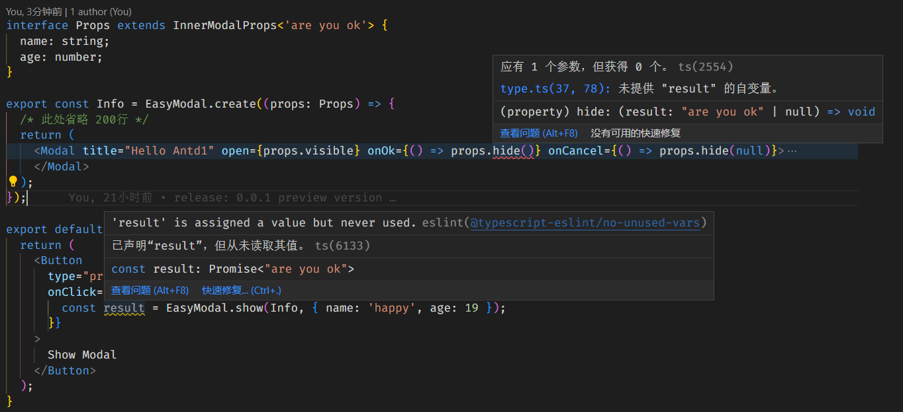

<h1 align='center'>Ez Modal React</h1></p>

一个简单易用的 Modal 状态管理库，用于 React 应用。基于 Context 实现。

[](https://www.npmjs.com/package/ez-modal-react) [](https://www.npmjs.com/package/ez-modal-react) [](https://github.com/raotaohub/ez-modal-react/blob/main/LICENSE)

<p align='center'>简体中文 | <a href='./README.md'>English</a> </p>

<a class="VPSocialLink" style="display:flex;justify-content:center;align-items:center;" href="https://discord.gg/hMzykrgC" aria-label="discord" target="_blank" rel="noopener" data-v-b8f6762d="" data-v-dbecf575=""><svg style="height:26px;width:26px;" role="img" viewBox="0 0 24 24" xmlns="http://www.w3.org/2000/svg"><title>Discord</title><path d="M20.317 4.3698a19.7913 19.7913 0 00-4.8851-1.5152.0741.0741 0 00-.0785.0371c-.211.3753-.4447.8648-.6083 1.2495-1.8447-.2762-3.68-.2762-5.4868 0-.1636-.3933-.4058-.8742-.6177-1.2495a.077.077 0 00-.0785-.037 19.7363 19.7363 0 00-4.8852 1.515.0699.0699 0 00-.0321.0277C.5334 9.0458-.319 13.5799.0992 18.0578a.0824.0824 0 00.0312.0561c2.0528 1.5076 4.0413 2.4228 5.9929 3.0294a.0777.0777 0 00.0842-.0276c.4616-.6304.8731-1.2952 1.226-1.9942a.076.076 0 00-.0416-.1057c-.6528-.2476-1.2743-.5495-1.8722-.8923a.077.077 0 01-.0076-.1277c.1258-.0943.2517-.1923.3718-.2914a.0743.0743 0 01.0776-.0105c3.9278 1.7933 8.18 1.7933 12.0614 0a.0739.0739 0 01.0785.0095c.1202.099.246.1981.3728.2924a.077.077 0 01-.0066.1276 12.2986 12.2986 0 01-1.873.8914.0766.0766 0 00-.0407.1067c.3604.698.7719 1.3628 1.225 1.9932a.076.076 0 00.0842.0286c1.961-.6067 3.9495-1.5219 6.0023-3.0294a.077.077 0 00.0313-.0552c.5004-5.177-.8382-9.6739-3.5485-13.6604a.061.061 0 00-.0312-.0286zM8.02 15.3312c-1.1825 0-2.1569-1.0857-2.1569-2.419 0-1.3332.9555-2.4189 2.157-2.4189 1.2108 0 2.1757 1.0952 2.1568 2.419 0 1.3332-.9555 2.4189-2.1569 2.4189zm7.9748 0c-1.1825 0-2.1569-1.0857-2.1569-2.419 0-1.3332.9554-2.4189 2.1569-2.4189 1.2108 0 2.1757 1.0952 2.1568 2.419 0 1.3332-.946 2.4189-2.1568 2.4189Z"></path></svg></a>

## ✨ 特性

1. 基于 **Promise** ，使 Modal 和业务代码分离。
2. 支持 **hook** 和 **props** 注入 2 种方式，获得状态和控制权。
3. 支持 <a href="#typeinfer" title="使用返回值类型推导">返回值类型推导</a>，提高使用体验。
4. 支持 **React 16.8** 以上版本。
5. 支持 <a href="#config" title="配置hide时默认行为">配置</a>（隐藏弹窗时，是否默认销毁以及 resolve）。
6. 体积小(~1kb gzip)、易接入、无入侵性、支持任意 UI 库。

## 🔨 效果



## 📦 安装

```shell
# with yarn
yarn add ez-modal-react -S

# or with npm
npm install ez-modal-react -S
```

## 🚀 使用方式

1. **引入 EasyModal 使用 Provider**

```tsx
import EasyModal from 'ez-modal-react';

function App() {/* ... */}

ReactDOM.render(
    <EasyModal.Provider> // 包裹应用
      <App />
    </EasyModal.Provider>
  document.getElementById('root'),
);
```

2. **创建弹窗组件**

```tsx
import EasyModal from 'ez-modal-react';

const InfoModal = EazyModal.create((props) => (
  <Modal open={props.visible} onOk={props.hide} onCancel={props.hide}></Modal>
));
export default InfoModal;
```

3. **在任何地方使用**

- 调用 EasyModal.show，传入创建好的组件，打开弹窗

```tsx
import EasyModal from 'ez-modal-react';
import InfoModal from './InfoModal';

EasyModal.show(InfoModal, { name: 'foo' });
```

- 以上就是 EasyModal 的主要功能。

---

## ☀️ 更多

1.  <a name="typeinfer" id="typeinfer">使用返回值类型推导</a>

- 组件使用的 props 类型需要继承 **InnerModalProps**,确保正确的推导。

```diff
import EasyModal, { InnerModalProps } from 'ez-modal-react';

+ interface IProps extends InnerModalProps<'modal'> /*传入返回值类型*/ {
+   age: number;
+   name: string;
+ }

export const InfoModal = EasyModal.create(
+ (props: Props) => {
  return (
    <Modal
      title="Hello"
      open={props.visible}
      onOk={() => {
+       props.hide(); // warn 应有 1 个参数，但获得 0 个。 (property) hide: (result: "modal") => void ts(2554)
      }}
      onCancel={() => {
+       props.hide(null); //safe hide 接受 null 作为参数。它兼具 hide resolve 两种功能。
      }}
    >
      <h1>{props.age}</h1>
    </Modal>
  );
});

+ // warn 类型 "{ name: string; }" 中缺少属性 "age"，但类型 "ModalProps<Props, "modal">" 中需要该属性。
EasyModal.show(InfoModal, { name: 'foo' }).then((resolve) => {
  console.log(resolve); // 一切正常将得到 "modal"
});
```

2. <a name="使用hook" id="usehook">使用 hook - useModal</a>

- 如需获得 ts 推导需要给 `useModal`方法传入泛型参数

```diff
import EasyModal, { useModal, InnerModalProps } from 'ez-modal-react';

+ interface IProps extends InnerModalProps<'modal'>/* 指定返回值类型 */ {
+   age: number;
+   name: string;
+ }

export const Info = EasyModal.create((props: Props) => {
+  const modal = useModal<Props>(); // 传入当前组件props的类型 可以获得 类型推导
+   console.log(modal.props) // 当前组件接收到的 props
+  modal.hide(); // 应有 1 个参数，但获得 0 个。ts(2554) (property) hide: (result: "modal") => void ts(2554)

  return <Moda>/*...*/</Moda>;
});
```

3. <a name="config" id="config">配置默认行为</a>

> EasyModal hide 方法调用时的默认行为：
>
> 1.  hide 时默认调用 resolve 并传入参数，给 promise 抛出成功
> 2.  hide 时默认调用 remove 销毁组件

> 为什么这么做？
>
> 1. 默认 remove: 绝大多数场景弹窗关闭意味着销毁这个弹窗，大部分 UI 库的 Modal 都遵循这一逻辑.
>
> 2. 默认 resolve: 同上。若需要 reject 意味着调用方还需要额外处理。完全可以通过 resolve(false) 实现。
>
> 3. EazyModal 允许配置上述 2 个默认行为 ，并提供 reject 方法。

- 改变默认行为的方式：在 open 方法传入第 3 个参数

```diff
EasyModal.open(Component, {},
+  config:{
+    resolveOnHide:false,
+    removeOnHide:false,
+  }
);
```

## 📚 API

```tsx
const CreatedModal = EasyModal.create(Component); // 创建合规的 EasyModal 弹窗 返回值:EasyModalHOC

const result = EasyModal.open(CreatedModal, Props); // 打开 CreatedModal 弹窗 返回值:promise

const ______ = EasyModal.hide(CreatedModal); // 关闭 CreatedModal 弹窗 返回值:undefined

props; // 在组件内 EasyModal 会注入除用户自己的参数外，的额外属性

const modal = useModal(); // 在 CreatedModal 组件内使用；返回值同props


type props | modal :
 {
  id: string; // 当前 Modal id
  visible: boolean; // 当前 Modal 显示状态 ；
  hide: function;  // 隐藏当前 Modal 方法 ；默认调用 resolve & remove
  remove: function; // 销毁当前 Modal 方法 ；
  resolve: function;// 当前 Modal resolve 方法 ；
  reject: function; // 当前 Modal reject 方法 ；
  ...
}
```

- 关于 useModal 和 注入的 props 区别

> 1. 在组件内部得到的 **props** 和 **useModal()** 返回值 **具有相同的属性和方> 法**。
> 2. **useModal()** 返回值的`hide` `resolve`方法 ，和大多数 hook 一样默认不具备类型推导。你必须显式给 useModal 方法传入当前组件的 props 类型。
>
>    > btw 这正是我做这个项目的原因，我喜欢直接使用 props。而是市面上如 nice-modal-react 无法提供。

<a href="#usehook" title="使用 hook">使用 hook</a>

## 🎮 Codesandbox Demo

[Demo Link](https://codesandbox.io/p/sandbox/confident-shape-rt7bzr?embed=1)

## ⭐ 灵感来源

1. fhd @xpf
2. [nice-modal-react](https://github.com/eBay/nice-modal-react)

## 🙏 鸣谢

感谢[SevenOutman (Doma)](https://github.com/SevenOutman) 仓库搭建的支持, 我借鉴与参考了他的 [aplayer-react](https://github.com/SevenOutman/aplayer-react) 项目。

## ⌨️ 其他

[Issues](https://github.com/raotaohub/ez-modal-react/issues)

## LICENSE

[MIT](https://github.com/raotaohub/ez-modal-react/blob/main/LICENSE)

---
