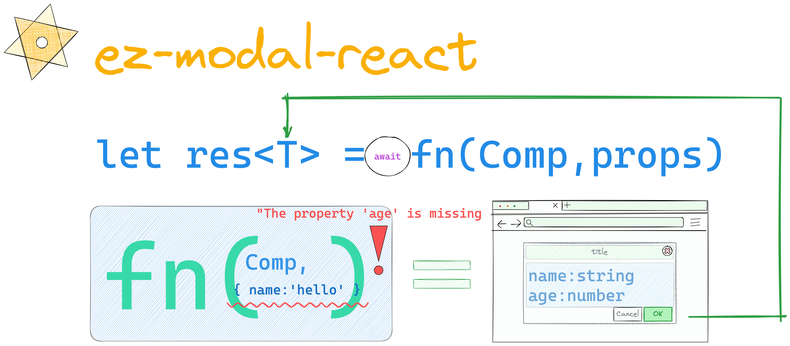

<p><h2 align='center'>EasyModal</h2></p>

<span style="margin-left:32px">​EasyModal</span> 的理念很简单：将模态框的操作视为异步事件，通过 Promise 管理其生命周期。并且提供类型推导和约束。

<p align='center'>简体中文 | <a href='./README.md'>English</a> </p>

<p align="center">
<a href="https://www.npmjs.com/package/ez-modal-react" target="__blank"></a>
<a href="https://www.npmjs.com/package/ez-modal-react" target="__blank"></a>
<a href="https://raotaohub.github.io/ez-modal-react-book/en-US" target="__blank"></a>
<a href="https://raotaohub.github.io/ez-modal-react-book/en-US" target="__blank"></a>
</p>

## ✨ 特性

1. 基于 **Promise** 封装，灵活易用可减少繁琐的状态管理。
2. \>=React 16.8，支持 <a href="#typeinfer" title="使用返回值类型推导">返回值类型推导</a>，和类型校验。
3. 体积小(~1kb gzip)、易接入、无入侵性、支持任意 UI 库。

## 🔨 Documentations

[中文文档](https://raotaohub.github.io/ez-modal-react-book) | [English](https://raotaohub.github.io/ez-modal-react-book/en-US)

[Example](https://raotaohub.github.io/ez-modal-react-book/example) | [codesandbox](https://codesandbox.io/p/sandbox/confident-shape-rt7bzr?embed=1)

## 📦 安装

```shell
# with yarn
yarn add ez-modal-react -S

# or with npm
npm install ez-modal-react -S
```

## 🚀 使用方式

1. 使用 Provider

```tsx
import EasyModal from 'ez-modal-react';

ReactDOM.render(
    <EasyModal.Provider> // 包裹应用
      <YourApp />
    </EasyModal.Provider>
  document.getElementById('root'),
);
```

2. 创建弹窗组件

```tsx
import EasyModal, { InnerModalProps } from 'ez-modal-react';

interface IProps extends InnerModalProps<'modal'> {
  age: number;
  name: string;
}

const InfoModal = EazyModal.create((props: IProps) => (
  <Modal
    open={props.visible}
    //(property) hide: (result: 'modal') => void ts(2554)
    onOk={() => props.hide('modal')}
    onCancel={() => props.hide(null)}
    afterClose={props.remove}
  >
    <h1>{props.age}</h1>
    <h1>{props.name}</h1>
  </Modal>
));
```

3. 在任何地方使用

```tsx
// 类型 "{ name: string; }" 中缺少属性 "age"，但类型 "ModalProps<Props, "modal">" 中需要该属性。
const res = await EasyModal.show(InfoModal, { name: 'foo' });
console.log(res); // type res:'modal'
```

## 鸣谢

1. fhd @xpf
2. [nice-modal-react](https://github.com/eBay/nice-modal-react)
3. 感谢[SevenOutman (Doma)](https://github.com/SevenOutman) 仓库搭建的支持, 我借鉴与参考了他的 [aplayer-react](https://github.com/SevenOutman/aplayer-react) 项目。

## LICENSE

[MIT](https://github.com/raotaohub/ez-modal-react/blob/main/LICENSE)

---
